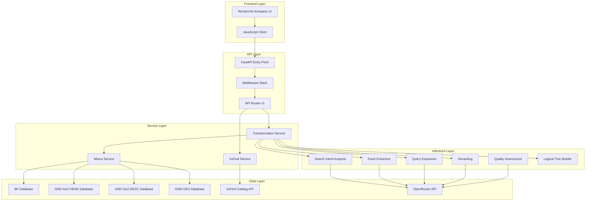
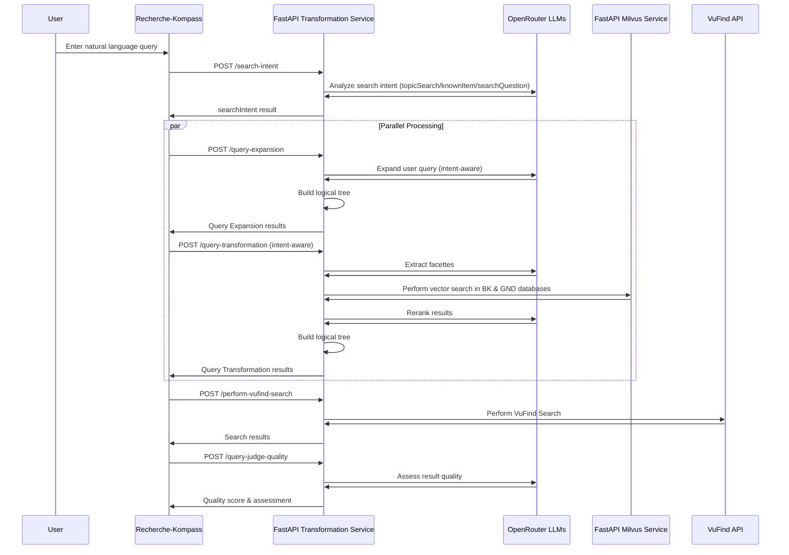
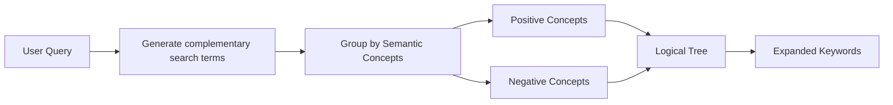
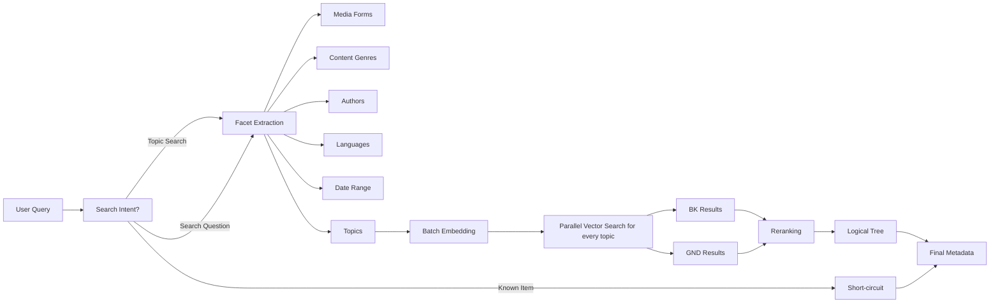
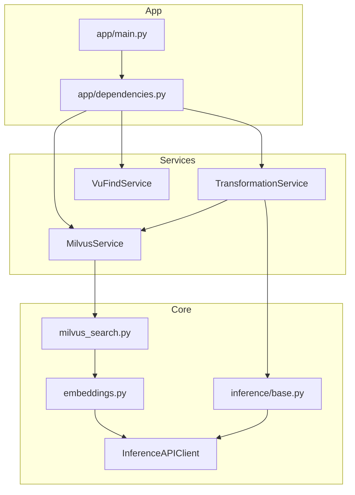

## System Architecture

### High-Level Architecture



### Request Processing Flow



### Query Expansion Pipeline



### Query Transformation Pipeline



---

## Software Architecture

### Design Patterns

| Pattern | Implementation | Purpose |
|---------|----------------|---------|
| **Service Container** | `app/dependencies.py` | Dependency injection for lazy-initialized services |
| **Repository Pattern** | `core/milvus_search.py` | Abstracts database operations |
| **Pipeline Pattern** | `research-compass.js` | Sequential step execution with independent UI updates |
| **Strategy Pattern** | `core/inference/*.py` | Interchangeable inference modules |
| **Middleware Pattern** | `app/main.py` | Cross-cutting concerns (logging, CORS, IP blocking) |

### Service Dependencies



### Data Flow Architecture

```
┌─────────────────────────────────────────────────────────────────────┐
│                        Request Lifecycle                            │
├─────────────────────────────────────────────────────────────────────┤
│  1. HTTP Request                                                    │
│     ↓                                                               │
│  2. Middleware Stack                                                │
│     ├── Trusted Host Validation                                     │
│     ├── IP Blocking                                                 │
│     ├── Request ID Injection                                        │
│     ├── JSON Error Catching                                         │
│     └── API Request Logging                                         │
│     ↓                                                               │
│  3. Rate Limiting (SlowAPI)                                         │
│     ↓                                                               │
│  4. Endpoint Handler                                                │
│     ↓                                                               │
│  5. Service Layer                                                   │
│     ↓                                                               │
│  6. Core Inference / Search Layer                                   │
│     ↓                                                               │
│  7. External APIs (OpenRouter, VuFind, Milvus)                      │
│     ↓                                                               │
│  8. Response Building                                               │
│     ↓                                                               │
│  9. Pydantic Validation                                             │
│     ↓                                                               │
│ 10. HTTP Response                                                   │
└─────────────────────────────────────────────────────────────────────┘
```
