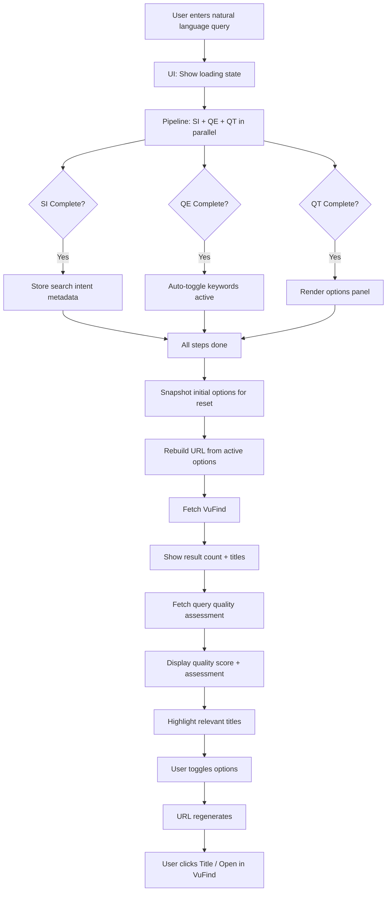
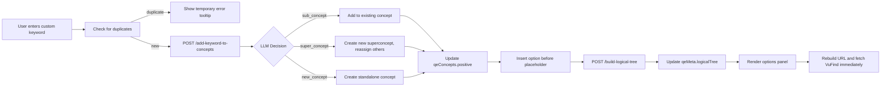
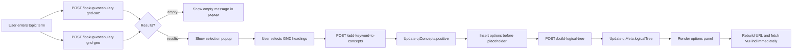
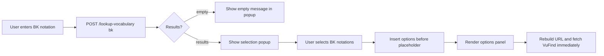
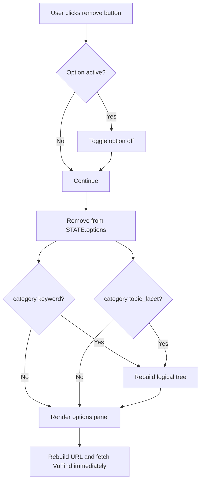
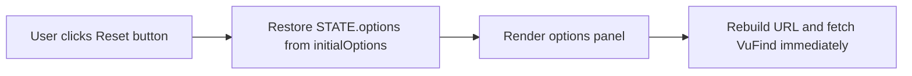
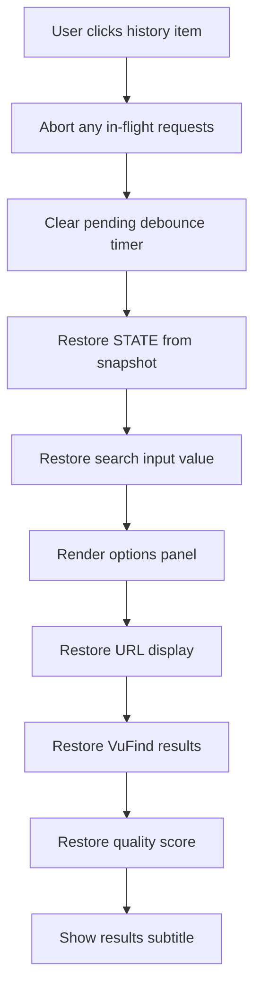
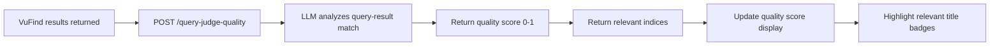

## User Workflows

### Main Search Workflow



### Options Toggle Workflow

```mermaid
flowchart LR
    A[User toggles option checkbox] --> B[Update option active state]
    B --> C[Rebuild URL from all active options]
    C --> D[Show loading state immediately]
    D --> E[Increment fetchId]
    E --> F[Start debounce timer]
    F --> G[After delay, fetch VuFind]
    G --> H[Show result count + titles]
    H --> I[Fetch query quality]
    I --> J[Update quality score display]
    J --> K[Highlight relevant results]
```



### Keyword Addition Workflow



### Custom Topic Heading Workflow



### Custom BK Number Workflow



### Option Removal Workflow



### Reset Options Workflow



### History Restoration Workflow



### Quality Assessment Workflow



### Vocabulary Selection Popup Workflow

```mermaid
flowchart TD
    A[Popup opens with vocabulary results] --> B[User can toggle items]
    B --> C[Select Some / Select All / Deselect All]
    C --> D[User clicks Apply]
    D --> E[Close popup]
    E --> F[Return selected items to handler]
    F --> G{topic_facet or bk?}
    G -->|topic_facet| H[POST /add-keyword-to-concepts]
    G -->|bk| I[Insert options before placeholder]
    H --> J[Update qtConcepts.positive]
    J --> K[POST /build-logical-tree]
    K --> L[Update qtMeta.logicalTree]
    L --> M[Render options panel]
    I --> M
    M --> N[Rebuild URL and fetch VuFind immediately]
    C --> O[User clicks overlay/Escape]
    O --> P[Close popup]
    P --> Q[Return to options state]